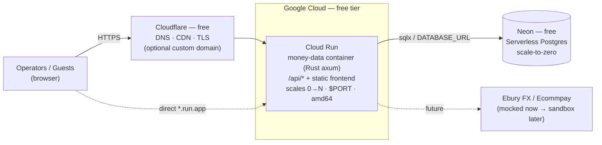

# Architecture

money·data is a single, cloud-agnostic Docker image (Rust/axum serving both the JSON
API and the built Vite frontend) backed by a serverless Postgres. For the validation
phase it runs entirely on **free tiers** — **$0** at low traffic.

## Free-tier deployment (Google Cloud Run + Neon)



ASCII fallback:

```
            (optional, free)
 Browser ──▶ Cloudflare DNS/CDN/TLS ──▶┐
 Browser ───────── HTTPS direct ──────▶│
                                       ▼
                          ┌────────────────────────────────┐
                          │  Google Cloud Run (free)        │
                          │  money-data container (Rust)    │
                          │   • /api/*  → JSON API           │
                          │   • /*      → built Vite app     │
                          │   • scales 0→N · $PORT=8080      │
                          └───────────────┬─────────────────┘
                                          │ sqlx (DATABASE_URL)
                                          ▼
                          ┌────────────────────────────────┐
                          │  Neon serverless Postgres       │
                          │  (free, no card, scale-to-zero) │
                          └────────────────────────────────┘
```

## Why this stack

| Concern | Choice | Reason |
| ------- | ------ | ------ |
| Compute | **Cloud Run** | Runs the existing Docker image unchanged; scales to zero (genuinely $0 idle); sub-second Rust cold starts. |
| Data | **Neon Postgres** | Free, no credit card, scale-to-zero (~1s resume). In-memory state is wrong for Cloud Run (scales to zero + multiple instances ⇒ data would vanish / not be shared). |
| Edge | **Cloudflare (free)** | Optional — only when you want a custom domain / CDN in front. |

## Money flow (unchanged by hosting)

```
Operator sets amount in settlement ccy ──▶ quote (mid_rate × 1.02 FX markup)
                                           + 1% processing fee
                                                  │
Guest pays total in presentment ccy ─(Ecommpay)─▶ wallet.pending += amount
                                                  │  platform revenue += markup + fee
Daily settlement batch ─(Ebury)────────────────▶ wallet.pending → wallet.available
Refund ─(card reversal OR direct debit pull)───▶ wallet balance reduced, status=refunded
```

## Components

| Layer | Tech | Location |
| ----- | ---- | -------- |
| API + static serving | Rust · axum · tower-http | `backend/src/` |
| Persistence | Postgres via `sqlx` | `backend/src/db.rs`, `backend/migrations/` |
| FX + fee math (Ebury/Ecommpay mocks) | pure Rust | `backend/src/fx.rs` |
| Dashboard | Vite · TypeScript · GSAP | `frontend/src/` |
| Container | multi-stage Docker (amd64) | `Dockerfile` |

## Roadmap (after validation)
1. Custom domain via Cloudflare (free) → Cloud Run domain mapping.
2. Merchant authentication / login.
3. Replace mock Ebury/Ecommpay with their sandbox APIs.
4. Move `DATABASE_URL` to Secret Manager; consider decimal money types for production.
